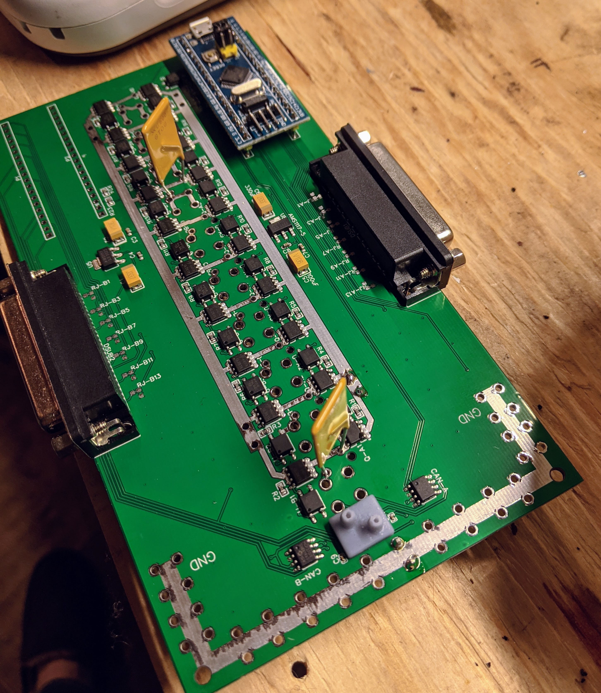

# The problem

Flying small aircraft and UAVs on legacy technology is too dangerous.  Technologies do exist now which can assist the pilot, but better approaches could do so much more.

# Essential Goals

1. Use the right technology and software to dramatically enhance small aircraft/UAV flight safety
1. Highly available/reliable, foundation-to-shingles fault tolerant
1. Explore integrate "smarts-system" approaches which enforce safety boundries as well as ease the pilot workload.
1. Build a product homebuilders and UAV manfacturers can purchase and easily integrate into their airframe build
1. Build dedicated hardware in supports of the other flight system goals

# Non-Essential Goals

1. Integrate flight training into the flight system
1. Remotely monitor/instruct/control an airplane from a ground station.  Ie; instructor mode
1. Cheaper; Fewer accidednts and integrated training means for a typical rental use, this system should be cheaper to own/operate than legacy aircraft systems. 
1. Certification and general availability to all light aircraft and UAV manufacturing

# Non-Goals

1. Airframe agnostic- Not building a new "safer airplane"... Building a safer flight system for any airplane.
1. Build a new OS/Framework/platform.  Use as much proven and off-the-shelf hardware and software solutions
1. Not developing a system for large transport aircraft.  Just too far out of scope and they are well represented.

# Foundation

_"Highly available/reliable, foundation-to-shingles fault tolerant"_; but what does that mean?

Fault tolerance is a first-class goal and requirement of this project.  That means everything from the transistors, to the operating system to the frameworks to the applications that handle a button click needs to support that goal.

The hardware the be dual bussed and fault-tolerant

The kernal must be "formally proven", that means it mathematically proven to not fail or have a security whole.  In this case, I'm considering the seL4(r) Microkernel.  https://sel4.systems/. 

The basic operating system functionality must support redundancy and fault tolerance (failing fast and supervision). I'm considering http://Kry10.com.

The framework the application is built on should also support that same fast failure and recovery, I'm choosing Elixier/Erlang BEAM-OTP.  What this means is that failure recovery isn't minutes or even seconds... Recovery from failure will be sub-second (at the framerate).

# Hardware

The core of the entire system needs to be a dedicated hardware device which combines;

Redundent;
- Aircraft Power
- Access to aircraft-wide low-level communication via CAN-bus
- Microprocessor control
- Pressure sensors
- Attitude sensors
- Critical system sensors

This board is called the Power, Attitude, Sensor & Switches (PASS) board.  The overall design took some inspiration from the human brain, set up in a left/right configuration to facilitate redundancy. Down the center is a 100A, 10-channel (10A/ch) dual-bus solid-state MOSFET/PolyFuse electrical system, each side/half also has 17 channels(34 total) of installer-configurable sensor I/O for engine/aircraft sensors. Dual pitot and static pressure sensors and dual AHRS are also hard wired on the board. Each half/side has a small 32-bit microcontroller that communicates with each other and connected peripherals via dual/dedicated CAN-bus controller. Each microprocessor communicates to its own dedicated embedded display system, which is where the real "smarts" of the whole thing live.

# Smarts Systems

Traditional software "Smart Systems" have a huge hype-cycle to overcome. But this isn't machine learning and it's a lot closer to tactical expert system.  This is really distilling all the best attributes of having a good co-pilot into basic rules and algorithms. These systems would be ideal for;

| Description | How it could work |
|-------------|-------------------|
| Weather analysis | Just simple pattern matching on actual reported and forecast weather in your flight path could easily provide good information to the pilot regarding adverse weather conditions|
| Phase of flight | If I'm appraching the destination airport... there's a very predicatable set of frequencies I will tune and checklists I will run.  This isn't rocket science... just tune the back chanel and walk me down the check list. This will be broken down in more detail as the design is flushed out. | 
| Rule analysis | If I haven't tuned the approach around a class bravo airspace, and I'm getting close, why can't you warn me? or if the weather at my destination isn't VFR, but I'm squawking VFR, I should know that. |

# First principal flight system

When we break all this down, you see fragments of visualization and service capabilties which compose a flight experiance.  I propose this list and I've grouped them by; Tactical/Excution, Strategic/Planning and Smart sytems.

| Tactical  | Strategic  | Smart sytems |
|-----------|------------|--------------|
| Instrumentation  | Maps w/Overlays  | Rules Anslysis |
| 1st Person Visualizations | Flight Routing/Planning  |  Controls & Autopilot |
| Terrain | System Monitoring  | Weather Decision Making  |
| Traffic |   | Flight phase Analysis  |   |   |
| Navigation Aids |   |   |
| Communications |   |   |
| Alerting |   |   |
| System Controls |   |   |
| Thermal Assistant |   |   |

These need to be recomposed into usable capabilities in the cockpit.  But, it's a reasonable start to just compose all of those capabilities into code modules.  Some produce visualizations, others will produce information displayed to the pilot via other dependant capabilities.

# Composed Solution

To faciliate all these a supervisor/worker architecture will be used. Here is just a sampleing of a few of basic components design;

## Periferal Integration

## Display System

## Instruments

## 1st Person visualization

## Traffic

## Communication

## System Controls

## Maps view

## Flight planning
