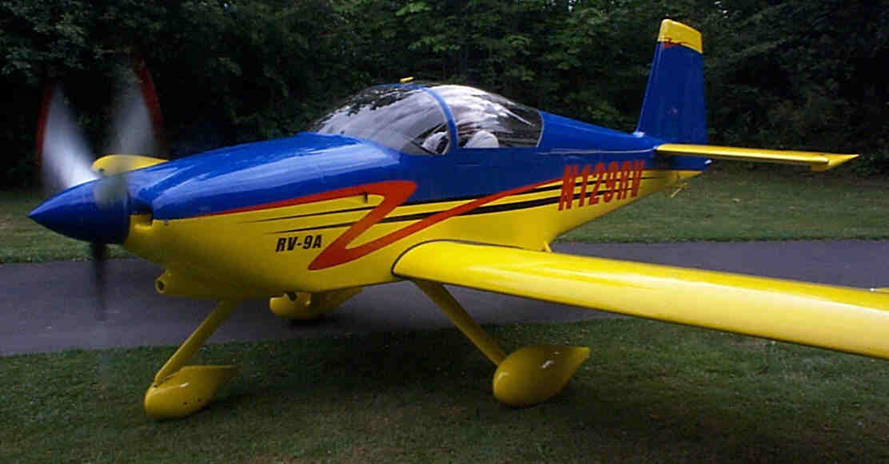
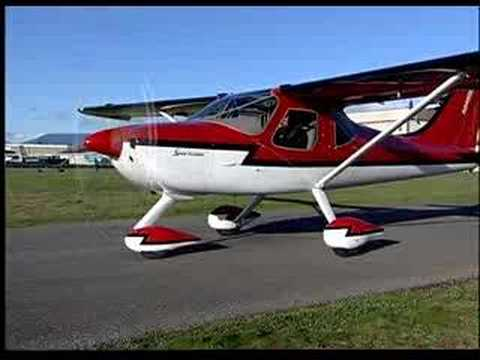
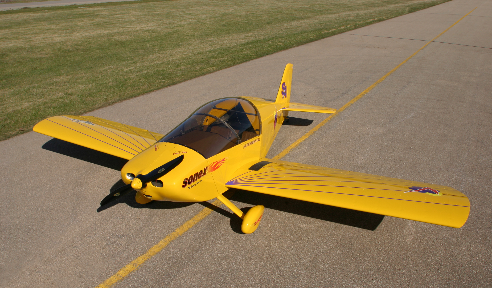
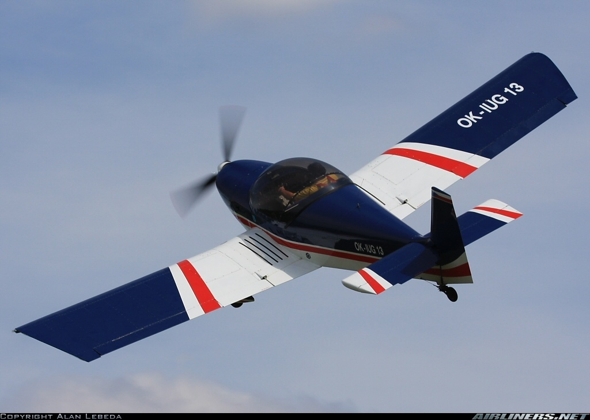
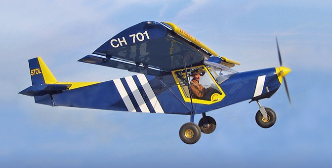
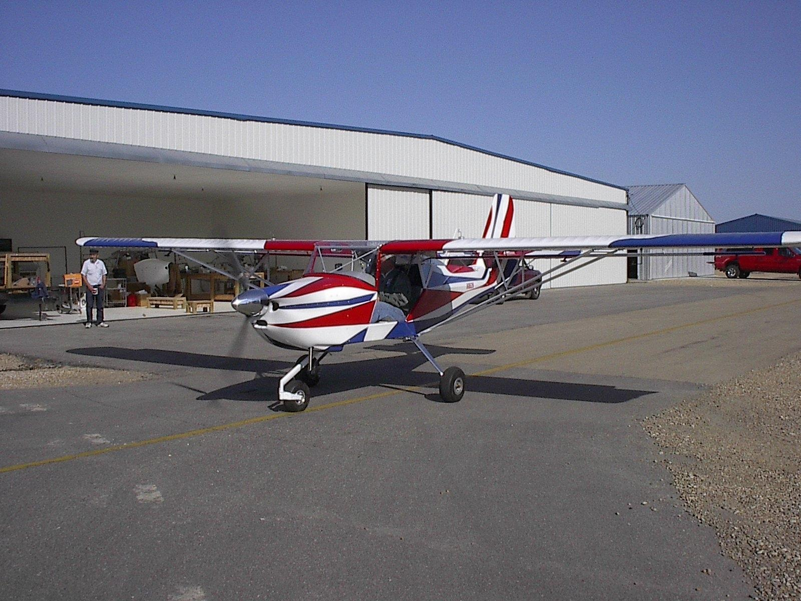
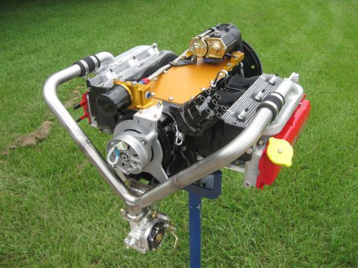
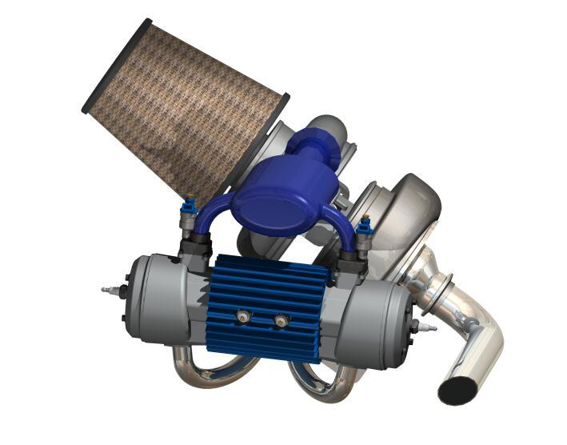
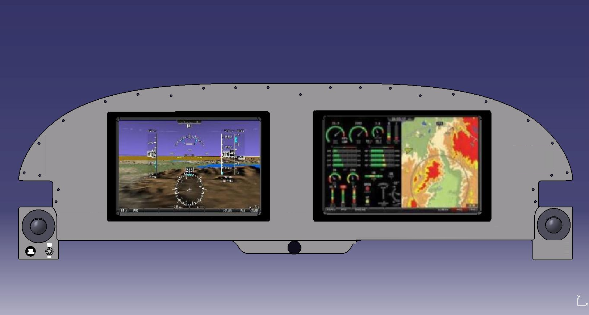

# About

The primary goal of the Phase 1 Airframe development is to focus on prooving out the concepts of the project.  The attributes of a test-bed aircraft is that it be simple yet mechanically robust (space for equipment), seats two for pilot and test engineer, aero-dynamically stable, easy to fly and experimental.

# Candidate airframes;

- Vans RV-9A

- GlasAir GlaStar (aka Sportsman)

- Sonex 

- Zenith CH 601

- Zenith CH 701

- Kitfox

We will purchase an actively flying airframe, from the list above, in a known airworthy condition.

# Critical Systems

- Powerplant
- Fuel
- Electrical
- Flight control

# Powerplant

Goals; 
1. Redunancy
1. Safe flight failure mode
1. Simple
1. Meeting mission goals

Engine Technology
- Intenral Combustion Engine (ICE)
- Electric
- Many flavors of "Hybrid"

Configurations
- Single Prop
- Co-axial Prop Pair
- Twin horiztonal
- Twin inline

## ICE
Pros - Well known technology, endurance

Cons - fuel cost, unreliable, maintenance, complexity, difficult to automate (FADEC)

## Pure Electric 
Pros - Ultra reliable, simplest possible solution

Cons - range = weight... very limitted missions without weight penalty

## Hybrids

### ICE with Electric Motor

Pros - Cheapest, easy to fly (no special ratings), lightweight, can replace starter/alternator, immediate and simple failure mode

Cons - Propellor and crankshaft are a common failure mode

### Electric Motors + ICE Generator Set

Pros - Reliability, "genset" is more efficient than ICE.

Cons - Operating cost(fuel), Heavy (motors, props, generator and engine), modestly complex, maintenace

## Single Prop
Pros - Very simple, easy to fly.  Can be connected to a "dual" motor to add some power redundancy.

Cons - Single point of propulsion failure

## Co-Axial Prop Pair
Pros - Allows dual motors, still easy to fly, graceful failure

Cons - Because both props share the same space, failure of one can catastrophicaly fail the second.

## Twin side-by-side
Pros - Relatively efficient, proven acceptable failure modes

Cons - Additional skills required to manage failure modes

## Twin inline
Pros - Proven failure modes, failure mode

Cons - Logistically challenging, can be innificient

## Summary

If weight and money wasn't a thing... A side-by-side twin electric with removable ICE generator for cross countries likely meets the objectives best.

Since it needs to fly and airplanes fly on money... The hybrid ICE + Electric motor option is a good light/cheap/simple compramise.

# Fuel

Fuel system are best which have the following traits;

- One tank per engine
- Gravity fed

Note some options are low-wings, but given the powerplant configuration, we may still should be able to gravity feed if the fuel is located near or above the ICE.

Regardless of tank configuration all tanks will have a capacitive sensor and a seperate low-level indicator that provide fuel level information to the dedicated fuel management system.

# Electrical

_Dual redundant electrical systems_  There are many great source for redundant electrica systems.  I will defer to those.  They are not hard to build or understand, they do require some additional considerations.

_Switchless_ The entire electrical system will be actuated by PTS-fuse-issolated and solid-state or mechanical relays controlled by the electrical management system.  There will only be one bat switch in the cockpit labelled "Master/Essential/Off".  All other switching will be fuse issolated and actuated by the electrical management system.  This includes;

- Charge source(s) disable for DC-DC converter
- Flight control master
- Avionics master
- Lighting
- Accessories

_High / Low Voltage_ The electric motors will run at high voltage. That system will be recharged by a generator or the ICE engine.  A DC-DC converter will be used to feed the low voltage systems in the cockpit.  This is similar to how electric and hybrid vehicles generator low voltage system power.

# Flight control

The flight control system will initially be "human redundant".  This isn't ideal, but a truelly fail redundant fly-by-wire system is likely out of scope and perhaps recless to test without better background.  When _EVERYTYING_ else failes, I really wouldn't feel comfortable unless I knew I could hand-fly the test aircraft to a field. 
