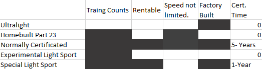

# Training and Certification

## How to certify the aircraft

Certification options range from Ultralight, Homebuilt, flavours of Light Sport all the way to normally certificated.  They each come with their trade-offs and limitations.

- "Traing. Counts" - Intended use includes training and hours in the aircraft count towards other ratings
- "Rentable" - Is "for hire" and can be rented to pilots for any approved use; this includes training, general transportation, recreation, a many commercial applications.
- "Speed not limited" - There is no specified speed limit in the certificated
- Factory built - Is built in a factor vs. home built
- "Cert. Time" - Time/effort to get a certificate to manufacture.

## Airframe certification approach

Initial phase 1 will likely be some form of homebuilt for the flexibility to adjust airframe and equipment.  At some point the systems will become somewhat standard, and optimistically investment levels will dictate what comes next.

The first saleable airframe would like be an S-LSA.  Purchase an existing manufacturer and overhaul their design could jump-start the development, but comes with their limitations.

## How to certify the Pilot

The private pilot certificate is a huge bar of several thousands of dollars for the general public.  It keeps all but the very enthusiastic from even attempting it.  Today a student need to hire a plane and an certified flight instructor (CFI) for 20 hours to just learn the basics, then spend an additional 15-30+ hrs of "self-training" to gain comfort and proficiency.  The FAA rules are immutable but they can be made much easier. 

Given this aircraft's ability to fly itself, the process by which a civilian turned into a certificated pilot has opportunities to be dramatically simpler and more cost effective.

For the first stages of training an instructor should guide the student through the basics of operation.  The FAA guideline for an instructor to solo a student is consistently good judgement and sufficient skills to operate safely.  As this airplane requires nearly zero pilot skills and enforces it's own judgement an instructor could sign them off after an introductory flight.  

Unless certification requirement can be altered (a fast-track part 141 curriculum accepted by FAA)... 20hrs with an CFI is going to be an absolute minimum bar.  The additional time they can achieve while doing other intended tasks, but under the limitations of "solo student pilot".  In theory, a student pilot can fly by her/him self indefinitely with 90-day signatures.  For a the Sport Pilot Certificate, only an additional 5 hours of solo is required.

As the student pilot approaches the practical test and achieves additional skills, the flight system naturally intervenes less and behave more similarly to a traditional 3-axis aircraft.  So as the student approaches the practical test, it will in effect be no different than a traditional 172 or a Warrior traditional aircraft. So once the student pilot achieve their private pilot rating, they will in reality have the skills to operate traditional aircraft.  It would be a disservice to general aviation if an unintended consequence of this effort was a generation of pilots that couldn't actually fly.  In the longest terms of this project, self-flying will become the objective, but in this distant scenario the person occupying the seat is a passenger, not a pilot.

Exactly how to transition an "off the street" civilian into solo student pilot, private and beyond should be studied more carefully later.

# Full-time built-in instructor

The aircraft itself will always be training all pilots at all levels.  Based on one's skills it will assume more or less control of all phases of flight.  All pilots will have to regularly demonstrate flying skills like steep turns, stall and spin awareness, safe take-off and landing skills, night flying/proficiency, systems management and emergency procedures.  Management of this is ideally built-in and tracked by the flight management system.  It keeps a tally of your recent flying experience and shows you skills you are out-of-practice-on, allowing you to do them in-flight at your convenience.  A pilot can login at home any time, review their last lesson or old flight, see where they are in training and even check proficiency.  The same system would integrate on-line ground training towards your written test requirements concurrent with flight training.  This same system will extend into instrument and commercial ratings.

At first, inexperienced pilots will have to establish critical skills and habits as introduced by the CFI.  Training established, the inexperienced pilot continues to fly gaining skills and insights through the training program.  The flight computer tracks this training with entirely objective assessments.  Additionally online ground training will compliment flight training.  Demonstration of topics from the ground training in flight to help re-enforce and consolidate learnings.

# In summary

- Aircraft certification should be Special-LSA or Normally Certificated
- Pilot certification can't be changed, yet.. but it can be made much easier.
- Integrate self-paced ground and flight training at all pilot skill levels, with particularly attention on primary skills.
- Everyone at all levels will know how to fly and safely
