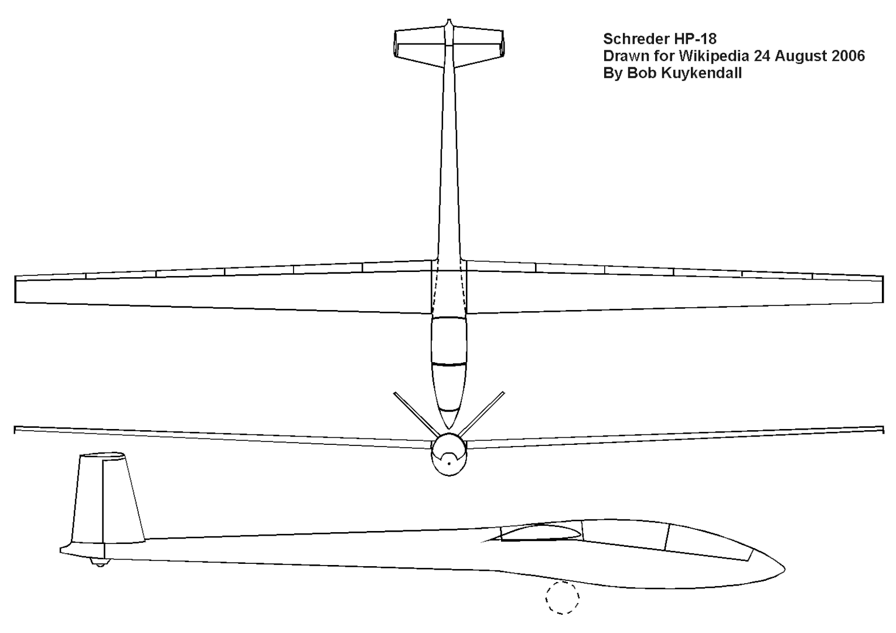
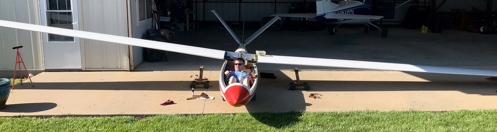

# background
The HP-18 is an amateur home-built pure glider, with the following specifications;

Crew: One pilot 
Length: 23 ft 2.4 in (7.07 m) 
Wingspan: 49 ft 2 in (15.00 m) 
Wing area: 113 ft2 (10.5 m2) 
Aspect ratio: 21.4 
Empty weight: 470 lb (213 kg) 
Gross weight: 970 lb (446 kg) 

# plan
So, here's a plan... (not entirely certain yet, but I'm liking this more and more)

# first
First, get the HP-18 airworthy.. get a brake master cylinder and rig it.  Cleanup the wing corrosion and get it inspected.  Then fly it once or twice.  Now for the real work!

# burn the boats

I already have a 25kw motor / controller designed for up to 100v.

## modifications

I'm going to chop off the nose (includes the nose tow hook). I may find a place to mount the hook later, but for now... gone. 

The best place for the battery modules is inside the wing ahead of the spar. Hollow the wing cavity using a hot knife and build a cradle to support it.  Positioning the battery well inside the wing would do better for flight loading, but nearer the root is easiest logistically and lowers the rolling moment of inertia. 

To mount the wings, I'll need a jack for the 250 lbs!  

## batteries

Here are the specs on the Tesla Model 3 battery module 23S46P

* 100v nom
* 11.7 kwh
* 191 lbs
* 67.5" x 11.5" x 3.5" 
* $2250+shipping each

The Tesla modules come with a built in BMS, but I will need some way to charge it.  The batteries will be hooked in parallel, so I can charge them individually.  At this current draw (250A) these batteries will get thermal stress, so I will either have to cool or de-rate.  6k is 70A, that's very low thermal stress.  We'll see!

## weight ballance and performance
So all in, empty should go from something like (570 + 400 + 30) = 1000 lbs.  Typical weight with me will be 1160. As the weight is in the wings, CG and flight loads are minimally impacted. Stall speed would be 10-15% higher.  For now I'll use a fixed two-blade prop, longest length that the gear will allow (54-60" seems about right).  Eventually I may design a folding system with the nose I cut off.

# Missions
23.4kwh of battery is a TON!  A cross country mission profile could look like... 
* full power for 2 minutes take-off
* cruise-climb to 8,000' at 400 fpm on 15kw for 20 minutes
* With 20 kwh remaining, cruise for 2.5 hrs at 6kw

Figure 90kts cruise, total distance 300nm.  

But this configuration lends itself to a new kind of mission as well...  Take off, cruise heading wherever the conditions are best locally that day, soar as you go.  End of the day power up and head home.  In theory, you could use 3.5hrs of power over 4-8hrs of power/gliding, using streets, one could several hundreds of miles in a day, find a charger and head home the next day.
