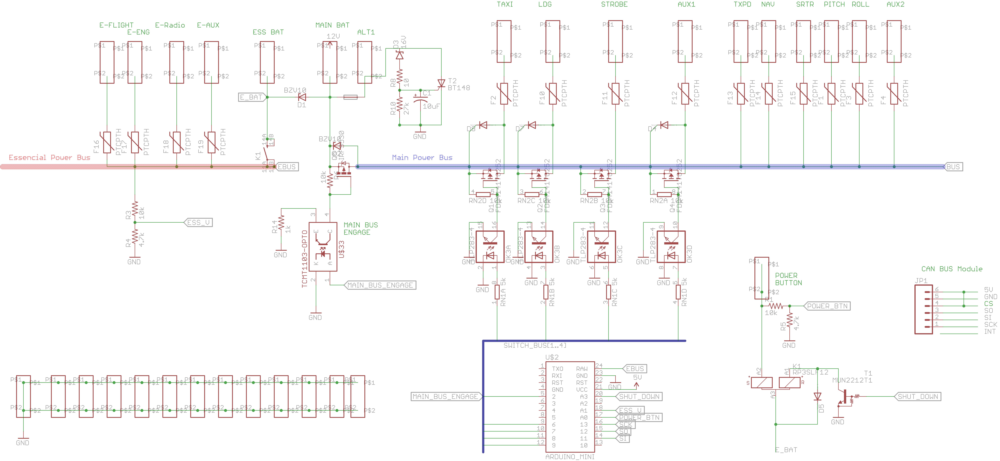
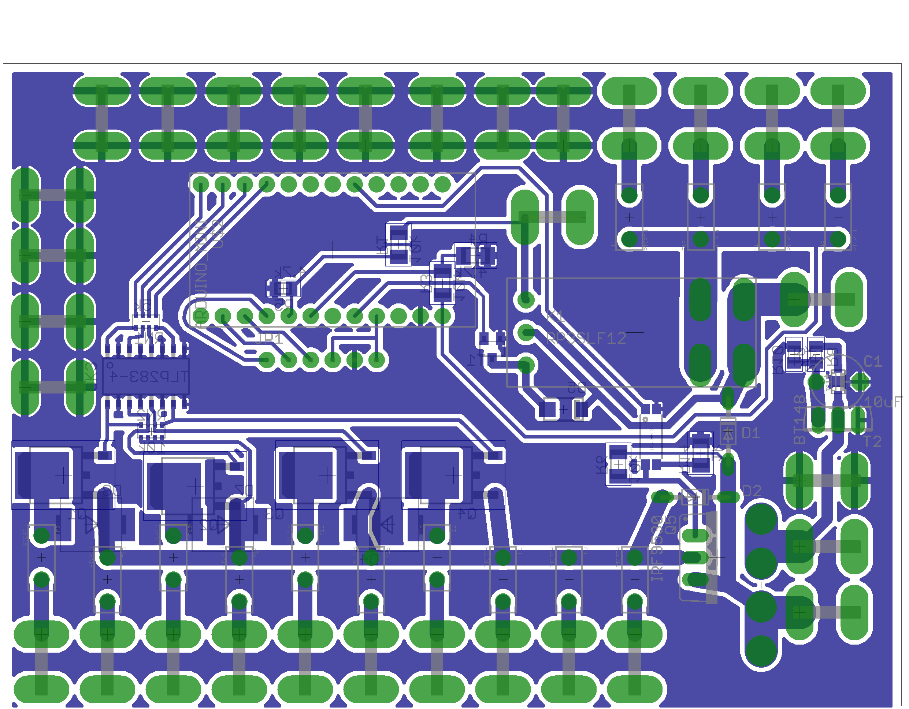

# Aviation electrical system from ground-up

So what would the low-voltage aircraft electrical system look like if you wanted to start over?  

1. Should be on a PCB, not wired by hand
1. Should directly and correctly support dual battery/essential bus
1. Should integrate with the main flight computer via serial communication (CAN-bus or RS-485) 
1. Built-in over/under voltage
1. Doesn't need to switch everything, just what needs switching; lights.  Everything else is always on.
1. Must fuse every line
1. Turns itself off if you leave it on
1. Is failure resistant, simple failures don't shut everything down

# Electrical system on a board

Automobile manufactures figured this out in the 90's and board-connector-harness wiring is far more reliable than spaghetti wiring. Incorporating all electrical best-practices, in an "out of the box" already proven and tested repeatable circuit is far superior to  hand wiring switches.  While it may seem simpler, critical features of a highly reliable electric system are complicated and they are messy.  Better to organize the mess on a printed board. 

In the end, it minimizes wire-fraying/failure, mis-wiring, rats-nesting, ground-looping, over/under voltage, alternator protection, circuit protection and generally puts all power related concerns in one place.  One down-side consideration; PCB traces cannot handle high currents, for that reason, the higher capacity buses on the PCB will be soldered in with additional bare wire, in extreme cases, dedicated jumper wires will be used.   It also simplifies the integration of a micro-controller enhancing the benefits even more.  

This board is 4" x 3.2" (100mm x 800mm) 

# Current Load Analysis

Modern aircraft, with LED lighting and higher efficiency avionics use much less current than traditional aircraft... by half or more.  Here's a break-down of load by circuit (SWAG numbers);

| Description | Peak Load | Typical Load | Day VFR Cruise  |
| ----------- | --------- | ------------ | --------------- |
| Transceiver|  8|  1|  1 |
| Transponder|  4|  2|  2 |
| Navigation Lights|  1|  1|  0 |
| Strobe|  5|  1|  1 |
| Landing Light|  5|  5|  0 |
| Taxi Light|  5|  5|  0 |
| EFIS|  1|  1|  1 |
| EFI/Igntion|  2|  2|  2 |
| Fuel Pump(s)|  8|  4|  0 |
| |  Total|  22|  7 |

Individual peak loads are useful for fuse sizing, but typical load total is how to size the alternator and main circuit bus loads.

# Electrical Power Management Controller (EPMC)

This controller is the heart of the electrical power system and is responsible for powering on, monitoring bus voltages, current loads and board temperatures, controls all lighting circuits and powering-down the aircraft.

The controller will receive GPS information from the flight control system via serial bus (CAN or RS-485).  This will include height above ground and time of day.  This information will be used to manage the light system.  The controller can also receive explicit requests to turn on/off any switched  circuit (Strobe, Landing, Taxi & Aux).  It will broadcast current usage, temperature and switch status for other systems to monitor or display.

# Power-Up

There's only one physical input to the entire electrical power system.  It can be on-the-board or remote.

This button is a momentary-on switch which directly energizes an essential-bus master latch relay.  Because this specific relay is the most critcal for energy delivery to the entire aircraft, a latching relay is chosen as once the circuit is energized it does not require energy to stay energized, so momentary drops in voltage/power will not turn off the entire system.  The non-essential bus relay is then energized off the essential bus using either a solid state or normal electro mechanical relay.

# Power-down

There are four modes of power down;

1. Nominal pilot initiated (hold down power button 10 seconds)
2. Idle, extended low-power. Pilot can walk away, it turns itself off (timeout, avoids the "I left the master on" surprise)
3. Accident/extreme acceleration
4. Under voltage battery protection

### Normal / Pilot requested shut-down
Hold the power button down for 10 seconds, then releasing, signals a request to power-down the aircraft. The EPMC can read the voltage on the essential latching relay and senses it's engagement.  Once released, this informs the EPMC to de-energize the essential latching relay to "off".  

### Idle
The EPMC will also turn off the relay after a period of 5 minutes of engine off, powering down and securing the aircraft's electrical system.  

### Accident 
A separate impact indicator (large forward accelerometer) attached to the EPMC will also trigger an electrical shut-down.

### Low voltages
If the drops to the minimum battery voltage for more than 5 seconds, the system will shut down. 

# Light system design

Based on how pilots use aircraft lighting system, there's no obvious requirement for dedicated individual switches on each light sub-system.  Furthermore, the light management follows a very specific navigation need predictably by altitude and time of day as follows;

- Nav - Always on
- Strobe - Default on, rarely selected off for flight inside clouds where it is a distraction (sensor sharp lighting spikes in the cockpit?)
- Landing/Taxi - On at night below 1000'

The master power controller will use the altitude information and time of day information sent from the flight control computer to determine the above logic.

_Cockpit lighting_ is an independent low-energy LED system that is always powered directly off the essential bus and makes it's own light-level determination from ambient light sensor and pilot input (brighter/dimmer).

So... what is the pilots experience and input.  For the most part, they will never even think about the lighting system, it will just do what you need when you need it.  The only input the pilot gives is interior light level and turning the strobes off via the flight control system or dedicated soft-switch (tapping the power switch twice quickly?).

# Protection

Fuses do not protect components, they protect the aircraft from fire.  

## PTC circuit protection
Every positive voltage line going into or out of the controller is fused.  The use of PTC-style fuses is most appropriate for aircraft use as attempting to reset a breaker or swap a fuse in flight is impractical.  PTC are very simple in operation, they provide current to a specified level, once exceeded, they interrupt the flow of current to a very low trickle (very high resistance),they will stay in this high-resistance mode until the entire load is removed, internally cool and resetting the circuit.  This is an appropriate mode for flight.

## Large loads

The batteries and alternator(s) will use dedicated traditional slow-blow fusing.

## Alternator

The most dangerous common failure mode for an alternator's regulator is to go "unregulated", this happens when the regulator stops capping the voltage coming from the alternator and sends large voltages far beyond the specification for batteries and all system components.  It is critical that a backup over-voltage detection system engage within milliseconds to shut down the alternator at the source.  This is a well known circuit, but it will be incorporated into the power system as best practice for all alternator sources. 

# Solid State Switches

When possible, use solid-state (MOSFET transistor-based) switches.  While failure modes with solid state are abrupt, if protected and used within voltage and current parameters they have orders-of-magnitude longer life than heavily loaded mechanical relays or contact switches.
