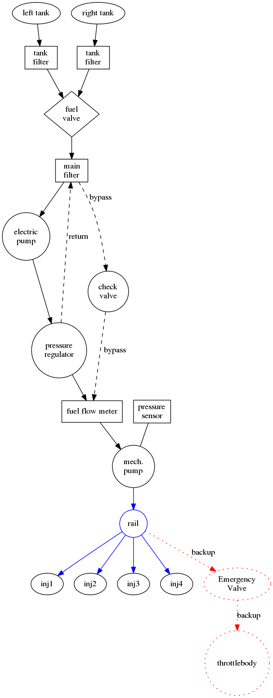
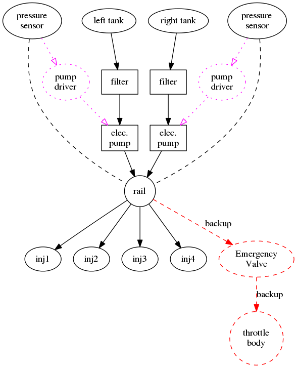

While ideally aircraft would be powered by simpler and more reliable power plants, I do have opinion on how to improve the fuel system in the aircraft I'm already flying.

Here's my current system and my first modification... hopefully this displays side-by-side for you.   The items in "blue" on the right are what is new/changing, anything black exists/stays.

|  Current |  First Mod |
| -------- | ---------- |
|  |   |

As you can see, the change is in the throttle body and emergency valve.  My current system suffers from high fuel flow sensor reading with the electric pump turned on.  I have confirmed it's a sensor problem by running at 2100 RPM, leaning to just barely alive and turning the fuel pump on/off and zero RPM or EGT change.  So it's a sensor problem, not an actual increase in actual flow.  I'm also concerned that the fuel pressure after the mechanical pump is not regulated... I believe the throttle body is absorbing it and probably causing slightly unpredictable/erratic fuel mixtures.

Any time I see a homebuilt with an "improving" a fuel system, I'm highly skeptical as they are usually creating a very serious safety problem in some mode, the one thing I've learned is that fuel systems are the way they are for a reason!  That said, I wanted to decompose it and maybe rebuild it differently with different trade-offs; key is knowing they are trade-offs and that they don't cause serious failure/safety concerns.... hence, I'd like your review.

Fuel system "first principals" (why is it on an airplane?)

1. Holds fuel in a reservoir (tank)
1. Moves, filters, measures and precisely disperses fuel from the reservoir to the intake in all conditions of flight (climbing,descending, inverted) and other system conditions (master on/off)

I looked at each component and asked "why is this here?"  Can it be done differently?  What if a micro-controller took responsibility for controlling redundent fuel pumps more carefully (with feedback).

These components didn't "have-to" to be there, if you think about it differently.

1. Fuel Valve
1. Bypass valves
1. Fuel Pressure regulator
1. Flow meter

Some critical operating modes;

Normal both fuel pumps are on a PID control loop, which sets the PWM duty cycle of the pump to regulate pressure at the rail pressure.  The dual EMUs control both left/right ignitions and both EMUs power all four injectors full time.

Fuel imbalance The PID loop pump controllers know both fuel tanks levels and the controller knows which pump it runs and adjust the duty cycle up/down to accommodate the imbalance.  If the imballance gets substantial, a "fuel imbalance" warning will alarm in the G3X.

One tank empty Assuming a completely dry tank (should be impossible if reserves are kept) but should a tank suck air.  Both fuel pumps will still be operating so the pump that has fuel will continue to overpower the pump which is sucking air.  The pumps in question can not flow fuel backwards easily.

Electrical Failures  The pump/EMU will have it's own battery backup which will continue to power the pumps for 30 minutes.  Over-voltage will cut the backup from the main electrical bus and reset will be on the ground.

Single EMU failure There are two that operate independently.  One operates the left plugs and fuel pump, the other the right plugs and right fuel pump.  They both energize the fuel injectors. If any one EMU fails, the other is in a hot standby to continue to operate the engine on the opposite mags and can independently actuate the fuel injectors.

Fuel Injector failure If any of the four fuel injectors fails, there is a direct throttle body injection which is achieved by manually fuel valve.  The three-way valve will simultaneously turn off fuel flow to the injectors.

Turning off all fuel in an emergency Can't do it... it is a closed fuel system.  If the fuel system is not damaged, it will not leak.  Dedicated fuel cut-off valves existed when fuel could continue to flow through carburetors, TBI, etc. Modern EMUs disable all injectors and ignition the millisecond they interprets the input to mean a sudden stop.  Further more all injectors are "normally closed" so they won't leak unless damaged.
